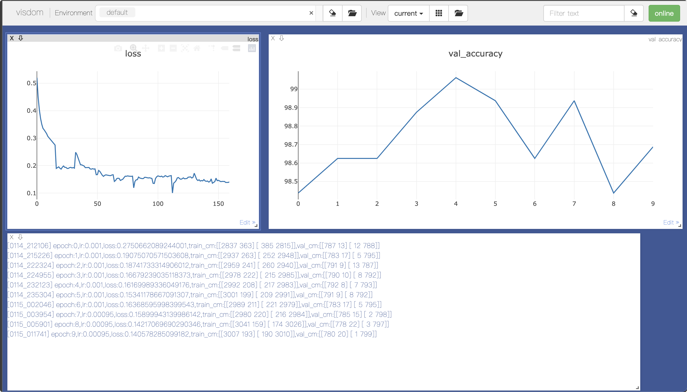

# dogsVScats

来源：[GitHub - gzshan/dogsVScats: 图像二分类问题 猫狗大战 pytorch CNN](https://github.com/gzshan/dogsVScats)

图像二分类问题 猫狗大战 pytorch CNN

使用ResNet34网络模型。

### 使用visdom监测运行过程

```bash
python -m visdom.server
```

然后浏览器打开`localhost:8097`，visdom使用默认的8097端口



利用visdom来记录训练过程中loss的变化和每次epoch的accuracy变化图像。

每`print_freq`一组记录`loss`变化图像：

```python
if ii % opt.print_freq == opt.print_freq - 1:
    vis.plot('loss', loss_meter.value()[0])
```

记录每次训练`accuracy`变化图像：

```python
vis.plot('val_accuracy', val_accuracy)
```

计算验证集上的指标及可视化：

```python
vis.log(
    "epoch:{epoch},lr:{lr},loss:{loss},train_cm:{train_cm},val_cm:{val_cm}"
    .format(epoch=epoch,
            loss=loss_meter.value()[0],
            val_cm=str(val_cm.value()),
            train_cm=str(confusion_matrix.value()),
            lr=lr))
```


